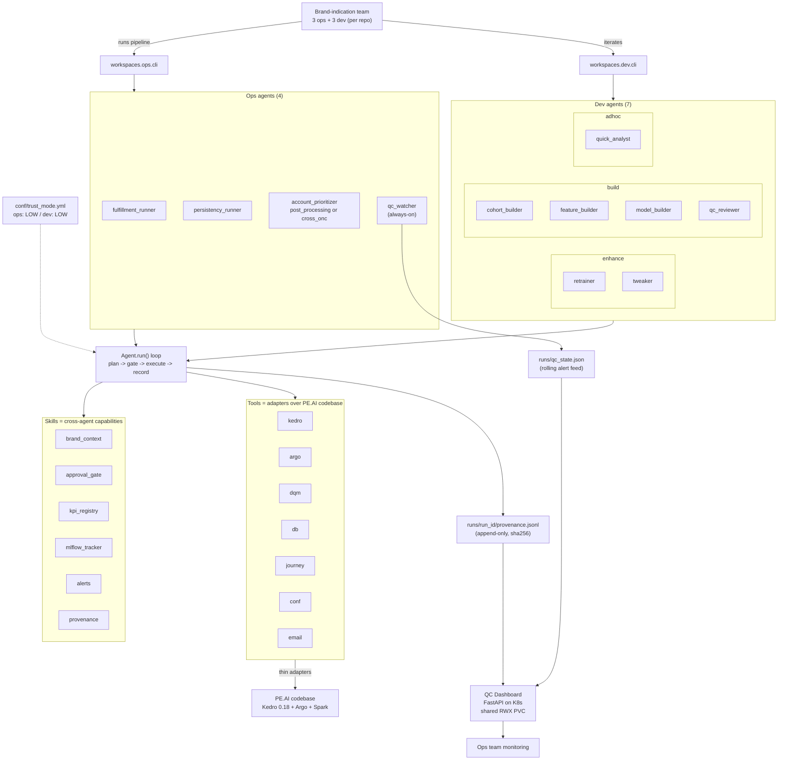
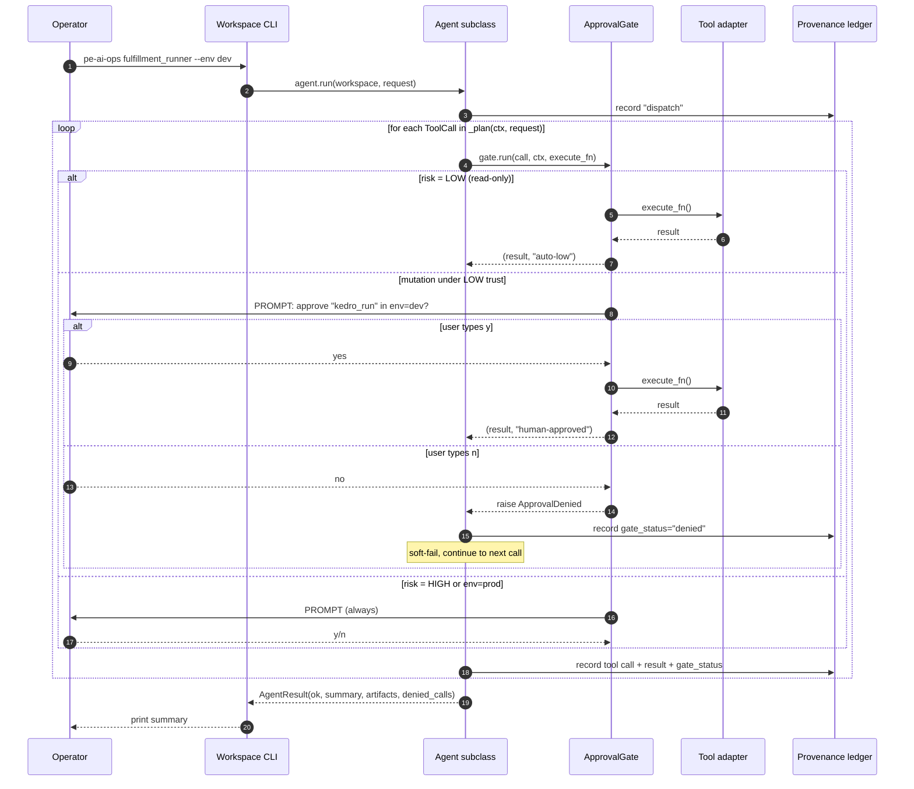
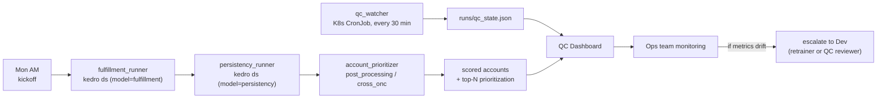
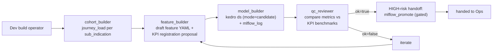
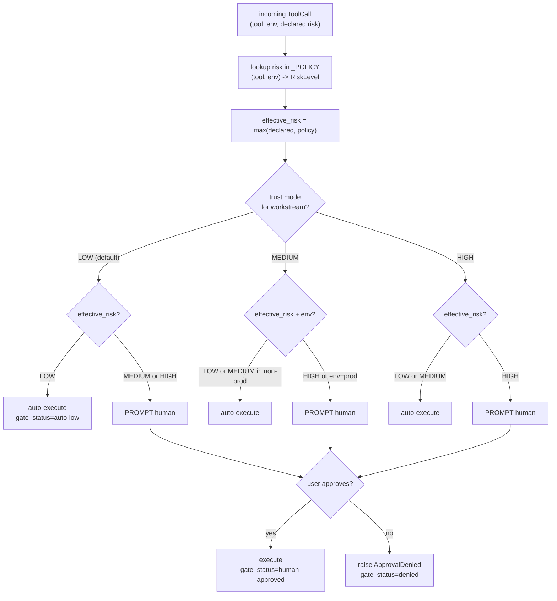
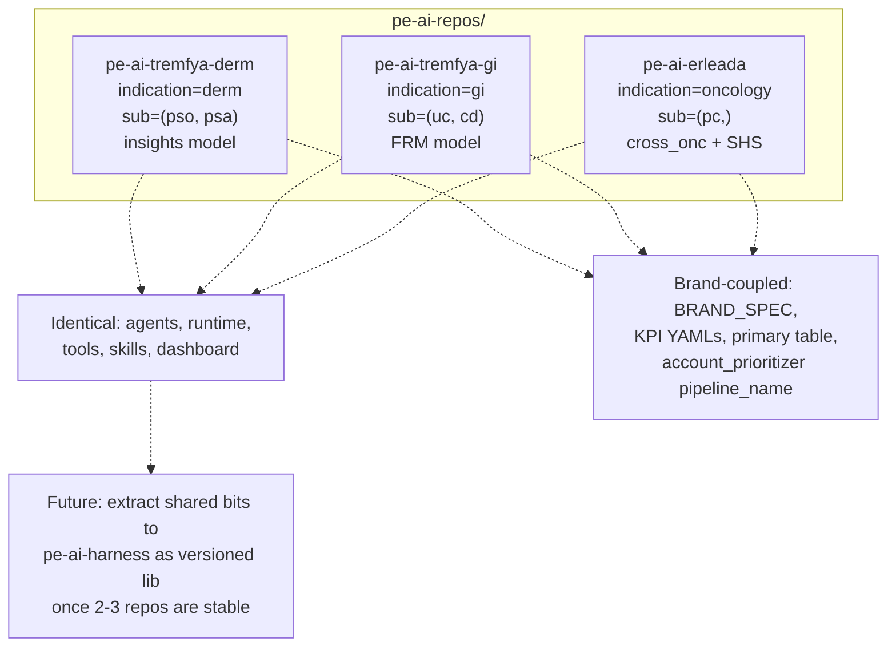

# PE.AI Agentic Harness -- Diagrams

GitHub renders these Mermaid diagrams inline. In VS Code, install the
"Markdown Preview Mermaid Support" extension (`bierner.markdown-mermaid`)
or use the built-in preview in recent versions.

The same diagrams apply to all three sibling repos
(`pe-ai-tremfya-derm`, `pe-ai-tremfya-gi`, `pe-ai-erleada`); only
`BRAND_SPEC` and a handful of brand-coupled paths differ. This file
lives in the reference repo (`pe-ai-tremfya-derm`).

---

## 1. System topology

Who calls what, and where the data flows.

---

## 2. Plan -> gate -> execute -> record (one tool call)

What happens inside `Agent.run()` for every `ToolCall` the agent emits.

---

## 3. Ops weekly flow

---

## 4. Dev build track flow (new model end-to-end)

---

## 5. Risk + trust decision matrix

How the gate decides whether to auto-execute or prompt the human.

---

## 6. Repo topology (3 brand-indication repos)

